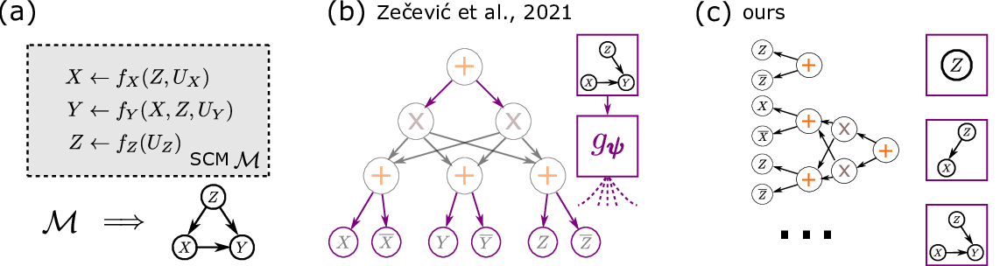

### A Taxonomy for Inference in Causal Model Families

#### Submitted to CLeaR'23

Official code repository for the corresponding paper.

Contains a partial re-implementation of [Xia et al. 2021](https://arxiv.org/abs/2107.00793) (since their code base as of writing is not yet public).

---

**Code Structure:**

* `aux` contains helper functions
* `models` contains base functions like neural nets, sum-product networks but also the actual (T)NCM
* `expX` reproduces an experiment as found in the paper